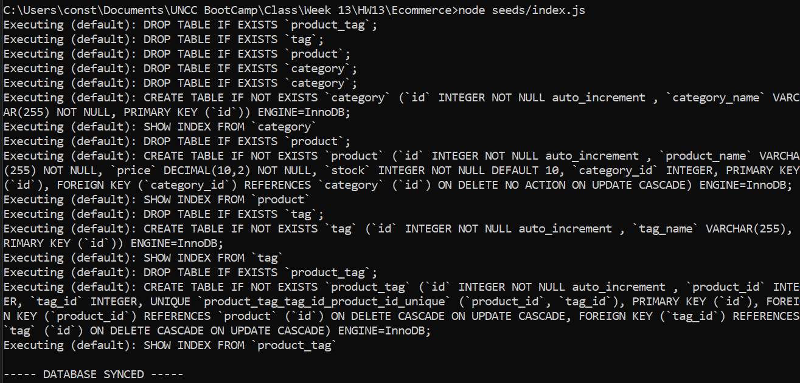
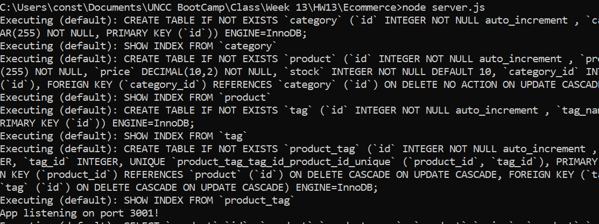
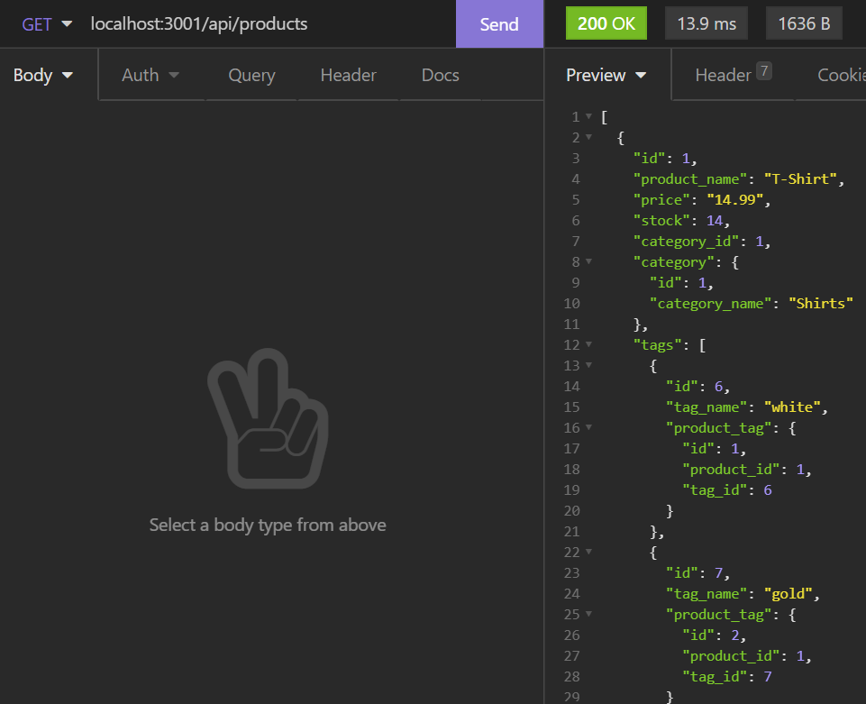
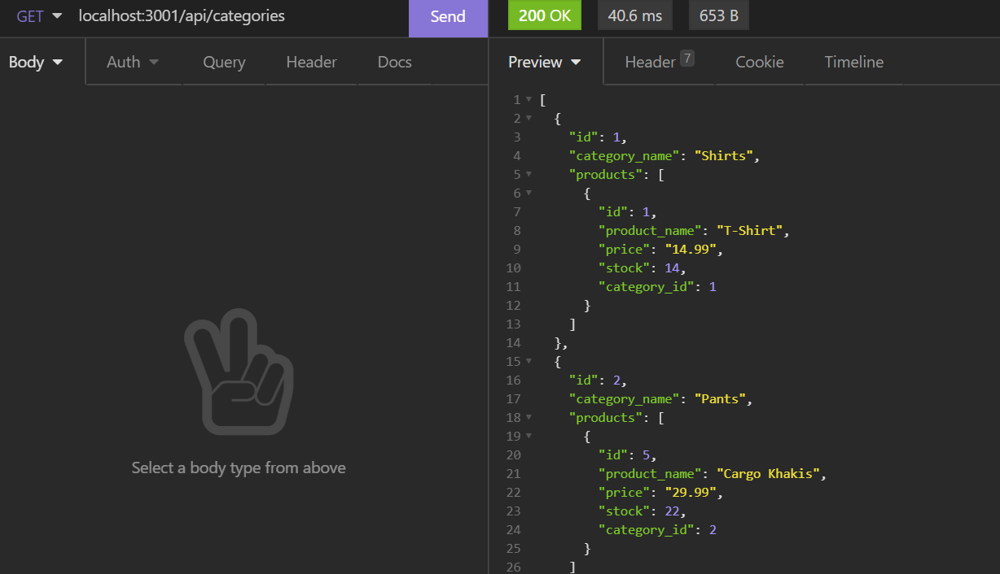
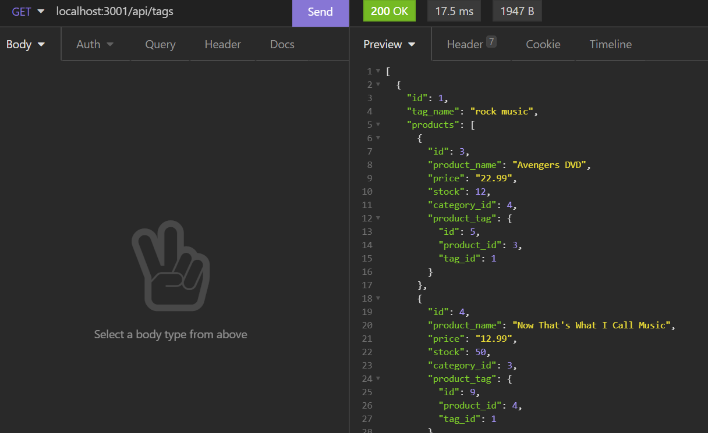
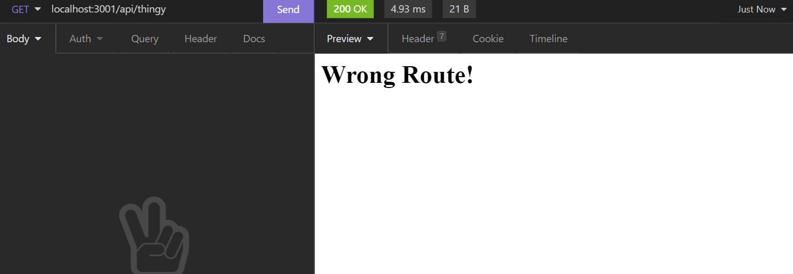
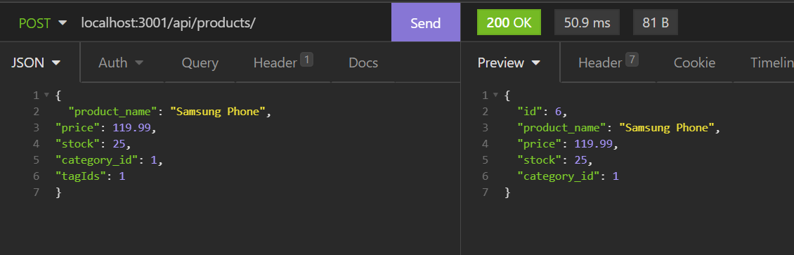

# #13: Ecommerce

## Description:

## Video: [Ecommerce Walkthrough](https://drive.google.com/file/d/1nQaiwCUmKnQTlzKvn8LG1vGFD_T5sT7I/view?usp=sharing)

 

# Installation:

- Run:

Seed:

                package.json -  "seed": "node seeds/index.js"
                npm init -y
                npm run seed

---

Activate:

                node server.js

# Usage:

- Start-up:

Seeding

Activate

- Viewing:

Products:

Categories:

Tags:

Error:

- Posting:

- Deleting:

# Questions: https://github.com/Crowderyan

### Email me: <a href="mailto:Rebuiltrival@gmail.com" hspace="20">Rebuiltrival@gmail.com</a>
